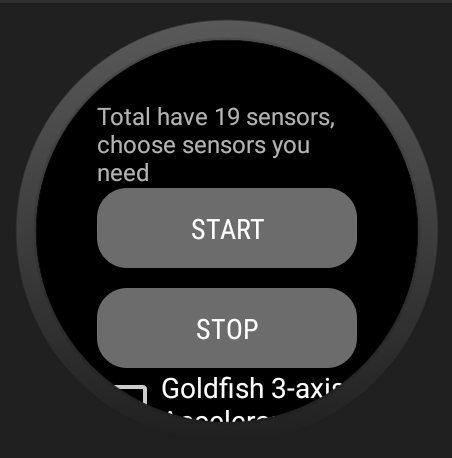

# AllSensorCapture
 
Based on Android Studio, implement the function to collect sensors data in android device. We develp the app in Wear OS round System.

Important Files:
- `*.txt`: the sensors data that collect in the device.
- [Use](#Use): introduction to use this app.

## Use
- The main interface:

- Select the sensor that need to collect:

- Click `start`, start to collect. Click `stop` to stop collecting:

- If the sensor doesn't work, then:

# Author

- Zijie Tang
- zijietang0316@gmail.com
- [GitHub](https://github.com/zijietang0316)
- [LinkedIn](https://www.linkedin.com/in/zijie-tang-4ba81b240/)
